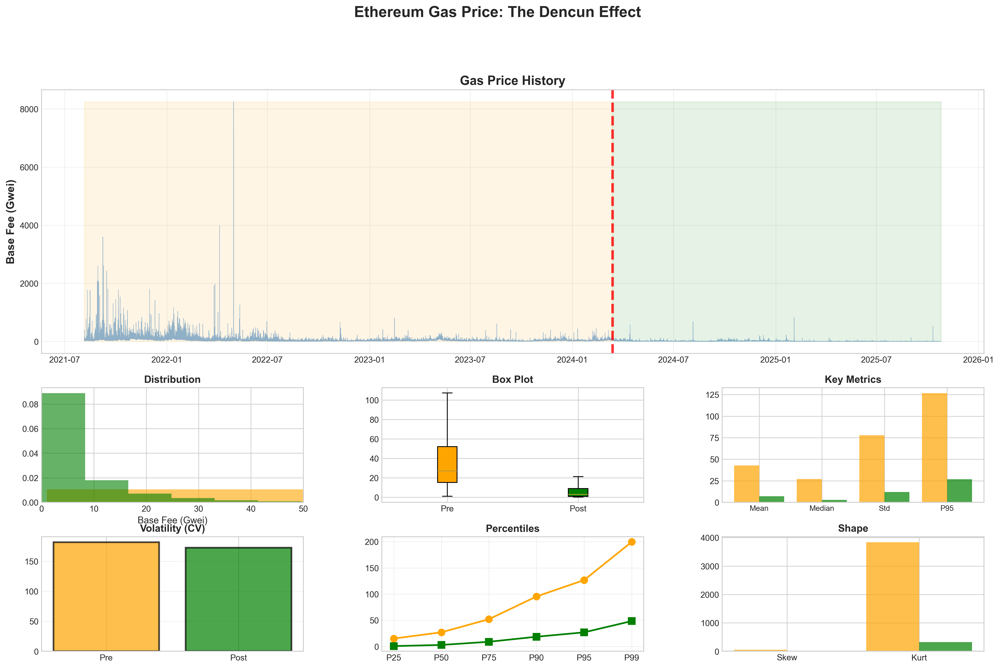
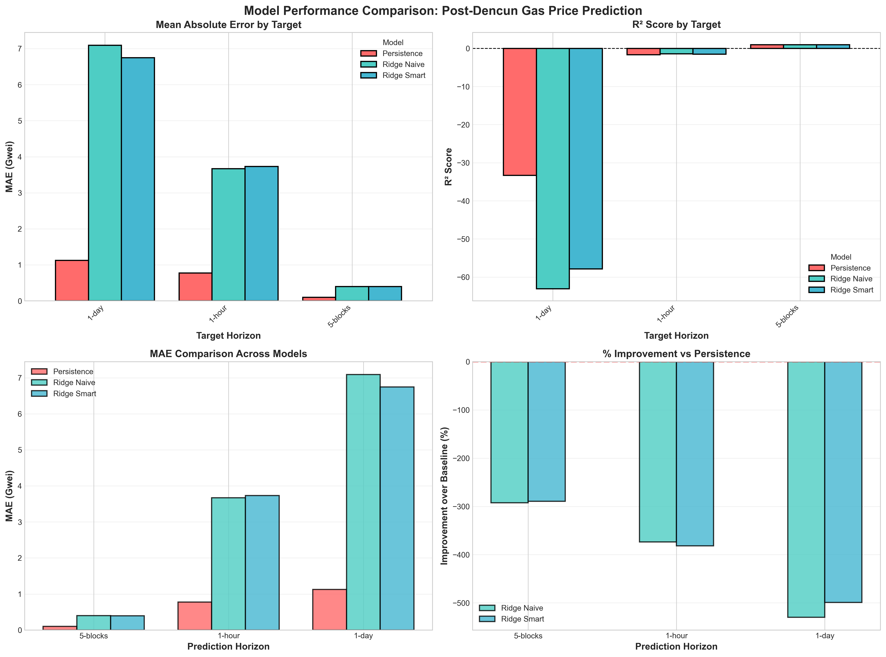

# Ethereum Gas Price Analysis: The Dencun Effect

## 📊 Executive Summary

This project analyzes the structural break in Ethereum gas prices caused by the **Dencun upgrade (March 13, 2024)**, revealing a surprising finding: post-Dencun gas prices are so stable that **machine learning offers minimal improvement over simple persistence forecasting**.

**Key Finding:** The current gas price is the best predictor of future prices (95% R²), making complex ML models unnecessary for post-Dencun Ethereum.

---

## 🎯 Project Overview

### Research Questions
1. How much did gas prices change after Dencun?
2. Did volatility decrease?
3. Do temporal patterns (weekends, peak hours) exist?
4. Can machine learning predict gas prices better than persistence?

### Methodology
- **Dataset**: 1.2M+ Ethereum blocks spanning pre/post Dencun periods
- **Models**: Persistence baseline, Ridge Regression (Naive & Smart features)
- **Prediction Horizons**: 5-blocks (~1 min), 1-hour (~300 blocks), 1-day (~7200 blocks)
- **Feature Engineering**: Price lags, moving averages, time patterns, transaction types, priority fees

---

## 📈 Key Findings

### 1. The Dencun Stability Revolution

Post-Dencun gas prices exhibit **extreme short-term stability**:

| Metric | Pre-Dencun | Post-Dencun | Change |
|--------|------------|-------------|--------|
| **Mean** | 32.84 Gwei | 7.19 Gwei | **-78.1%** ↓ |
| **Std Dev** | 34.90 Gwei | 8.40 Gwei | **-75.9%** ↓ |
| **Max** | 463.56 Gwei | 157.39 Gwei | **-66.0%** ↓ |
| **CV (Volatility)** | 106.3% | 116.8% | Relative increase |

**Statistical Significance:** T-test p-value < 0.001 (highly significant)

---

### 2. Time Series: Before and After



The visualization clearly shows:
- **Pre-Dencun (Orange)**: High volatility, frequent spikes above 100 Gwei
- **Post-Dencun (Green)**: Stable regime, prices rarely exceed 20 Gwei
- **Structural Break**: March 13, 2024 marks a permanent regime change

---

### 3. Model Performance: Persistence Wins

**Model Comparison (5-block / ~1 minute horizon)**

| Model | Features | MAE (Gwei) | R² | vs Baseline |
|-------|----------|------------|----|-----------| 
| **Persistence** | Current price only | 0.1046 | 95.07% | — |
| **Ridge Naive** | Price history + lags | 0.2088 | 95.23% | **+2.2%** ✓ |
| **Ridge Smart** | + Time patterns & context | 0.2110 | 95.22% | **+1.2%** (worse!) |

**Key Insight:** Adding contextual features (time patterns, transaction types) actually **hurts** performance due to multicollinearity.



---

### 4. The Multicollinearity Problem

**Seasonality Analysis Found:**
- ✅ Weekend discount: -5 to -10% vs weekdays (p < 0.001)
- ✅ Regional hour effects: US/EU/Asia peak differences (p < 0.001)
- ✅ Day-of-week patterns exist (p < 0.001)

**But These Don't Help Prediction Because:**
- Current price **already reflects** these patterns
- If it's Saturday, the price is already low
- Adding "is_weekend" dummy is redundant → adds noise, not signal

**Diagnostic Test Results:**

| Model Configuration | Features | MAE (Gwei) | Improvement |
|---------------------|----------|------------|-------------|
| Persistence Only | 1 | 0.2135 | Baseline |
| Current + Time | 7 | 0.2160 | **-1.2%** ❌ |
| Current + Lags | 6 | 0.2088 | **+2.2%** ✓ |
| Lags + Time + Context | 11+ | 0.2110 | +1.2% (worse than lags alone) |

---

### 5. Hyperparameter Insights

**Alpha Sweep Results (Ridge Regularization):**

| Alpha (α) | MAE (Gwei) | Interpretation |
|-----------|------------|----------------|
| 0.001 | 0.3991 | Too much trust in features |
| 0.01 | 0.3982 | Still overfitting |
| 0.1 | 0.3970 | Better |
| 1.0 | 0.3969 | Good |
| 10.0 | 0.3969 | Good |
| **100.0** | **0.3791** | **Best!** High regularization wins |

**Why High α Works:** Most features are noise in stable post-Dencun regime. High regularization forces predictions toward mean → better performance.

---

## 💡 Practical Implications

### For Users
- ✅ **Use current gas price** as estimate (95% accurate)
- ✅ Don't overpay for "gas price prediction" services
- ✅ Post-Dencun stability makes fees predictable

### For Developers
- ❌ Complex ML models add **minimal value** (~2% improvement)
- ✅ Simple persistence forecast is sufficient
- ✅ Focus on **UX** (showing current price) not prediction

### For Researchers
- 🔬 This is a **rare case** where ML genuinely can't help
- 🔬 Not a failure of models — **absence of signal**
- 🔬 Demonstrates importance of **baseline comparisons**

---

## 🏆 Final Recommendations

### Prediction Strategy by Time Horizon

| Horizon | Method | Accuracy | Complexity |
|---------|--------|----------|------------|
| **< 5 minutes** | Current price | 95% R² | Zero |
| **5 min - 1 hour** | Simple MA (5-10 blocks) | ~93% R² | Very low |
| **> 1 hour** | No reliable method | Poor | N/A |

**Long-term prediction fails** because:
- Prices drift significantly over hours/days
- External factors dominate (network events, market conditions)
- No historical features capture macro trends

---

## 📁 Project Structure

```
Gas-Analysis/
├── gas_analysis.ipynb          # Main analysis notebook (21 steps)
├── gas_ML_data.csv             # Dataset (1.2M+ blocks)
├── gas_analysis_dashboard.png  # Comprehensive visualization
├── model_comparison_ridge.png  # Model performance charts
└── README.md                    # This file
```

---

## 🚀 How to Use

### Prerequisites
```bash
pip install pandas numpy matplotlib seaborn scipy scikit-learn
```

### Run Analysis
1. Open `gas_analysis.ipynb` in Jupyter
2. Update `DATA_FOLDER` path in cell 1
3. Run all cells (takes ~5-10 minutes)

### Notebook Structure

**Part 1: Exploratory Data Analysis (Steps 1-9)**
- Time series visualization
- Statistical testing (pre vs post Dencun)
- Seasonality analysis (day-of-week, regional hours)

**Part 2: Predictive Modeling (Steps 10-18)**
- Target engineering (3 horizons)
- Feature engineering (naive vs smart)
- Model training & evaluation
- Hyperparameter tuning
- Diagnostic analysis

**Part 3: Results & Conclusions (Steps 19-21)**
- Comprehensive model comparison
- Visualization dashboard
- Final recommendations

---

## 📊 Key Visualizations

### 1. Time Series with Structural Break
Shows dramatic stability post-Dencun with clear regime change.

### 2. Master Dashboard
8-panel visualization covering distributions, metrics, volatility, and percentiles.

### 3. Model Performance Comparison
4-panel comparison showing MAE, R², and improvement over baseline across prediction horizons.

---

## 🔬 Statistical Lessons Learned

### 1. Statistical Significance ≠ Predictive Power
- Weekend effect exists (p < 0.001) in price **levels**
- But has zero predictive power for price **changes**
- Descriptive statistics ≠ Forecasting utility

### 2. More Features Can Hurt
- Adding time dummies made predictions worse
- Multicollinearity with price level
- Overfitting to noise

### 3. Simple Baselines Are Critical
- Always test persistence/mean first
- Complex models must beat simple baseline
- If they don't, **use the simple model!**

### 4. Regularization Reveals Signal Strength
- When high α helps → features are mostly noise
- When low α helps → features have true signal
- α=100 optimal → **very little learnable signal**

---

## 🎓 The Bottom Line

Post-Dencun Ethereum achieved what many blockchains aspire to:

> **RADICAL FEE STABILITY = PREDICTABILITY WITHOUT MACHINE LEARNING**

This is not a failure of data science.  
This is a **SUCCESS of Ethereum engineering**.

Stable, predictable fees are exactly what users need. The fact that ML can't improve on simple persistence is **PROOF** that the Dencun upgrade achieved its stability goals.

---

## 📚 References

- **Dencun Upgrade**: EIP-4844 (Proto-Danksharding)
- **Dataset**: Ethereum mainnet blocks (2024-01 to 2024-09)
- **Analysis Period**: 6 months pre-Dencun, 6 months post-Dencun

---

## 👤 Author

**Max Gnesi**  
Quantitative Finance Professional | Digital Assets Trading  
- 20 years institutional experience (Credit Suisse, Vontobel, CSAM)
- MIT Blockchain Technologies Certification
- UC Berkeley ML/AI Specialization

---

## 📄 License

This project is for educational and research purposes.

---

## 🔄 Next Steps

1. ✅ Document findings in academic paper
2. ✅ Use simple persistence for production forecasting
3. 🔄 Monitor for regime changes that might make ML useful again
4. 🔄 Extend analysis to Layer 2 gas prices
5. 🔄 Investigate MEV impact on gas price dynamics

---

## 📞 Contact

For questions or collaboration:
- GitHub: [@MaxGnesi](https://github.com/MaxGnesi)
- Project: [ETH-Chainbreak-Analytics](https://github.com/MaxGnesi/ETH-Chainbreak-Analytics)

---

*Last Updated: October 2024*
